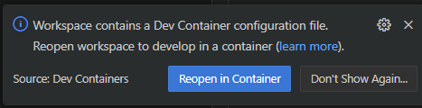

# SECDA-TFLite: A Toolkit for Efficient Development of FPGA-based DNN Accelerators for Edge Inference

The SECDA-TFLite toolkit leverages the TFLite delegate system to provide a robust and extensible set of utilities for integrating DNN accelerators for any DNN operation supported by TFLite.
Ultimately, this increases hardware accelerator developers' productivity, as they can begin developing and refining their design more quickly.


# Installation

## 0. Requirements

- Debian-based linux distro (highlighy recommended)
  - Install [docker for linux](https://docs.docker.com/engine/install/ubuntu/)
  - Install git: ```sudo apt install git```
- Otherwise, if using Windows:
   - Install WSL for windows and use Ubuntu 22.04
   - Install [docker for windows](https://docs.docker.com/desktop/setup/install/windows-install/)
- Install [VSCode](https://code.visualstudio.com/download) (highlighy recommended)
   - [Instructions for installing VSCode on Linux](https://code.visualstudio.com/docs/setup/linux#_install-vs-code-on-linux)
   - [Instructions for installing VSCode on Windows](https://code.visualstudio.com/docs/setup/windows)
   - Install [Dev Containers extension](https://marketplace.visualstudio.com/items?itemName=ms-vscode-remote.remote-containers)
 - Hardware Synthesis (Not required for simulation but recommended for updating simulation timing using HLS):
   - Vivado 2019.2 (required for SystemC HLS) | [Installation Guide](./docs/vivado_install.md)
   - Vitis 2024.2 (optional, required for logic synthesis for KV260) | [Download Link](https://www.xilinx.com/support/download/index.html/content/xilinx/en/downloadNav/vitis/2024-1.html)
   - Checkout the [hardware automation](./hardware_automation/README.md) for more information on how to use the hardware automation scripts.
   - Checkout the [FPGA Setup and Support Documentation](./docs/fpga_support.md) for more information on how to set up the FPGA board for SECDA-TFLite.


## 1. Repo Download and Configuration
### Download the SECDA-TFLite repo and install basic dependencies
Make sure you are in linux-based workspace environment with git installed. Run the following commands to download the SECDA-TFLite repo and install the basic dependencies:
```bash
git clone https://github.com/gicLAB/SECDA-TFLite.git && \
cd SECDA-TFLite && \
git submodule init && \
git submodule update && \
sudo apt install -y jq ssh rsync
```

### Configuring SECDA-TFLite
To enable all the tools of SECDA-TFLite has access to correct paths, you need to configure the [config.json](./config.json) file. This file contains the paths to the various directories and files used by the SECDA-TFLite toolkit. You **MUST** update the paths in the `config.json` file to point to the correct directories in your system. 

Additionally, for enabling remote hardware automation and also connecting to your target board, you need to update the `boards` section in the `config.json` file with the correct ip address, username, etc. Make sure you are able to SSH into the target board from your local machine.

Please refer to the [config.md](./docs/config.md) file for more information on how to configure the `config.json`  and also ensure SSH configuration is set up correctly for SECDA-TFLite to run smoothly.

### Run the setup script
Once you have configured the `config.json` file, you can run the setup script and checkout to the correct submodule branch of the TensorFlow repo:
```bash
# you might have to make this script executable "chmod +x ./setup.sh"
cd scripts && \
./setup.sh && \
cd ../tensorflow && \
git checkout secda-tflite-v2 && \
cd ../
```

Now you have the SECDA-TFLite repo downloaded and the basic dependencies installed. You can now proceed to set up the development environment [using VSCode dev containers](#2a-using-vscode-dev-container) (2.A - highly recommended), [using docker](#2b-using-docker) (2.B), or [natively on your system](2c-create-development-environment-on-natively) (2.C).

## 2.A: Using VSCode Dev Container
- Ensure docker is up and running, and there is a 'docker' group and current user is part of it
```bash
# might need to relog to apply the changes
sudo addgroup docker
sudo usermod -aG docker $USER 
```
code /path/to/SECDA-TFLite/SECDA-TFLite.code-workspace
```
- Open VSCode workspace using:  ```code /path/to/SECDA-TFLite/SECDA-TFLite.code-workspace```
- Install "Dev Containers" extension https://marketplace.visualstudio.com/items?itemName=ms-vscode-remote.remote-containers
- Once you installed the "Dev Containers" extension you reload VSCode using the command palette (Ctrl+Shift+P) and search for "Reload Window".
- The following pop-up should appear otherwise you can open the command palette (Ctrl+Shift+P) and search for "Dev Containers: Reopen in Container"


- Press `Reopen in Container`
- It should take a while to download and install the container.
- Once the container is created it should reopen you into the VSCode with the container active.
- You can access the container through "Dev Containers: Open Folder in Container" VSCode command.

**Note 1:** Hardware Automation Projects can only be configured inside the dev container. To use Vivado/Vitis you need to run your hardware project `run.sh` script outside the container (i.e. run the script from host machine terminal). Refer to the [hardware automation](./hardware_automation/README.md) for more information on how to use the hardware automation scripts.

**Note 2:** The dev container creates a conda environment called `secda-tflitev2` with all the required dependencies installed, and is activated by default.

## 2.B: Using Docker
This option is available in case you want to set up a containerized SECDA-TFLite development environment, but do not want to use VS Code with it.

- Ensure docker is up and running and current user is part of docker group
```
sudo usermod -aG docker $USER # change $USER to your Linux username
```
- Build the `secda-tflite` docker image
```
docker build -t secda-tflite -f .devcontainer/Dockerfile .
```
- Start a container from the image, mounting the repo to the container's file system
```
docker run -it -d --name secda-tflite -v .:/working_dir/SECDA-TFLite -w /working_dir/SECDA-TFLite secda-tflite
```
- You can now enter the container with the following command
```
docker exec -it secda-tflite bash
```
- The first time you enter the container, you must update its configuration
```
cd scripts && python3 ./update_config.py
```
- You can generate scripts to execute from shell the same tasks available in the dev container by running
```
cd scripts && python3 ./generate_task_scripts.py
```
  - `scripts/build.sh` can be used to build the executables
  - `scripts/launch.sh` can be used to execute example tasks; leveraging `scripts/build.sh` to build the required executables

**Note 1:** Hardware Automation Projects can only be configured inside the docker container. To use Vivado/Vitis you need to run your hardware project `run.sh` script outside the container. Refer to the [hardware automation](./hardware_automation/README.md) for more information on how to use the hardware automation scripts.

**Note 2:** The docker container creates a conda environment called `secda-tflitev2` with all the required dependencies installed, and is activated by default.

## 2.C: Create development environment on natively
### Setup Bazel and GDB
```bash
sudo apt install apt-transport-https curl gnupg -y && \
curl -fsSL https://bazel.build/bazel-release.pub.gpg | gpg --dearmor >bazel-archive-keyring.gpg && \
sudo mv bazel-archive-keyring.gpg /usr/share/keyrings && \
echo "deb [arch=amd64 signed-by=/usr/share/keyrings/bazel-archive-keyring.gpg] https://storage.googleapis.com/bazel-apt stable jdk1.8" | sudo tee /etc/apt/sources.list.d/bazel.list && \
sudo apt update && sudo apt install bazel-6.1.0 -y && \
sudo ln -sf /usr/bin/bazel-6.1.0 /usr/bin/bazel6
```
- Note: We symlink bazel-6.1.0 to `bazel6` to avoid conflicts with the bazel version already installed on the system. This is required for the SECDA-TFLite toolkit to work correctly.

### Setup Clang, CMake and Build Tools
```bash
wget https://github.com/Kitware/CMake/releases/download/v3.18.2/cmake-3.18.2-Linux-x86_64.sh && \
chmod +x cmake-3.18.2-Linux-x86_64.sh && \
sudo ./cmake-3.18.2-Linux-x86_64.sh --skip-license --prefix=/usr/local && \
rm cmake-3.18.2-Linux-x86_64.sh && \
sudo apt install -y build-essential software-properties-common && \
sudo apt install -y crossbuild-essential-armhf crossbuild-essential-arm64 libz-dev && \
sudo apt install -y gdb && \
sudo apt install -y clang-14 lld-14 clang-format-14 && \
sudo ln -s /usr/bin/clang-14 /usr/bin/clang && \
sudo ln -s /usr/bin/clang++-14 /usr/bin/clang++  && \
sudo ln -s /usr/bin/clang-format-14 /usr/bin/clang-format 
```

### Install Miniconda (Working with Ubuntu 22.04)
```bash
mkdir -p ~/miniconda3 && \
wget https://repo.anaconda.com/miniconda/Miniconda3-latest-Linux-x86_64.sh -O ~/miniconda3/miniconda.sh && \
bash ~/miniconda3/miniconda.sh -b -u -p ~/miniconda3 && \
rm ~/miniconda3/miniconda.sh && \
source ~/miniconda3/bin/activate && \
conda init --all && \
conda tos accept --override-channels --channel https://repo.anaconda.com/pkgs/main && \
conda tos accept --override-channels --channel https://repo.anaconda.com/pkgs/r && \
source ~/.bashrc  && \
conda config --set auto_activate_base false
```
### Create conda environment and install dependencies for SECDA-TFLite
```bash
conda create -n secda-tflitev2 python=3.9.19 -y  && \
conda activate secda-tflitev2  && \
pip install -r .devcontainer/requirements.txt
```
- Note: Within jupyter notebooks, you need to select the `secda-tflitev2` kernel to run the notebooks. 


###  Configure Tensorflow & Test Bazel build (make sure to activate secda-tflitev2 environment)
```bash
# make sure to set python path to /home/your_user/miniconda3/bin/python3
# make sure say no to clang as the default compiler
conda activate secda-tflitev2  && \
cd tensorflow  && \
./configure
```

### Test Bazel build
```bash
bazel6 build --jobs 1 //tensorflow/lite/examples/systemc:hello_systemc  && \
bazel6 run //tensorflow/lite/examples/systemc:hello_systemc
```

Now you should have everything set up to start developing with the SECDA-TFLite toolkit.


## 4. VSCode Instructions

### Recommended VSCode Extensions
- [C/C++](https://marketplace.visualstudio.com/items?itemName=ms-vscode.cpptools)   | Needed for the debugging
- [Python](https://marketplace.visualstudio.com/items?itemName=ms-python.python)    | Needed for running the python scripts and jupyter notebooks
- [Jupyter](https://marketplace.visualstudio.com/items?itemName=ms-toolsai.jupyter) | Needed for running Jupyter notebooks


Once the development environment is created, we recommend using VSCode to immediately start developing. Checkout the VSCode instructions below.

* Load VSCode `SECDA-TFLite.code-workspace` using "open workspace from file" option in the VSCode File menu. Note: within the container this workspace will be located at `/working_dir/SECDA-TFLite.code-workspace`.

* Once the VSCode workspace is loaded, you are able to run to the launch configurations through the [Run and Debug](https://code.visualstudio.com/docs/editor/debugging) tab to run the end to end simulation.
  
* These configurations are stored within '/tensorflow/.vscode/launch.json' (to launch) and /tensorflow/.vscode/task.json (to compile), you can edit these to change the parameters to compile and launch the the end to end simulation. Look at the [VSCode](./docs/vscode.md) for more information on how to use the VSCode task and launch configurations.

* There are some configurations already prepared to run and simulate some of the accelerator provided in the `src/secda_delegates/` directory.

## Repo Structure
Overview of the repo structure with the important directories presented below:
```
SECDA-TFLite/
├── config.json
├── data/
│   ├── inputs/
│   └── models/
├── docs/
├── hardware_automation/
├── scripts/
├── src/
│   ├── benchmark_suite/
│   ├── secda_apps/
│   ├── secda_delegates/
│   ├── secda_generator/
│   └── secda_profilier/
├── tensorflow/
└── tutorials/
```


# Paper
Our research paper covers the SECDA-TFLite toolkit in detail including case studies where we design and integrate new DNN accelerator using our toolkit. If you are using the SECDA-TFLite toolkit in research, we kindly request a reference to the following:

```
@article{Haris2023JPDC,
    title = {SECDA-TFLite: A toolkit for efficient development of FPGA-based DNN accelerators for edge inference},
    author = {Jude Haris and Perry Gibson and José Cano and Nicolas {Bohm Agostini} and David Kaeli},
    journal = {Journal of Parallel and Distributed Computing},
    volume = {173},
    pages = {140-151},
    year = {2023},
    issn = {0743-7315},
    doi = {https://doi.org/10.1016/j.jpdc.2022.11.005},
    url = {https://www.sciencedirect.com/science/article/pii/S0743731522002301}
}
```
