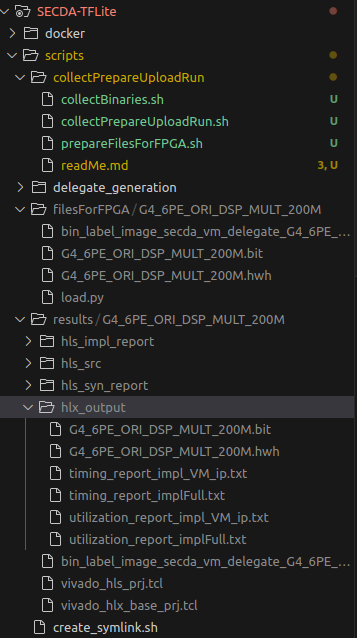
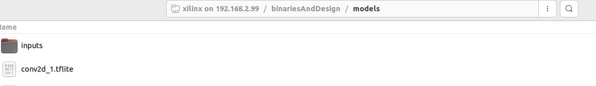

1. This folder will do following things: 
    - expect result folder: `../result` in the same level
    - under `../result`, there should be folders named by trial name, e.g.
    `G4_6PE_DSP_MULT_200M`, `G4_1PE_DSP_MULT_200M`...
    - under each trial folder, there should be following folder
        - `result/G4_6PE_DSP_MULT_200M/hls_impl_report/`
        - `result/G4_6PE_DSP_MULT_200M/hls_src/`
        - `result/G4_6PE_DSP_MULT_200M/hls_syn_report/`
        - `result/G4_6PE_DSP_MULT_200M/hlx_output/`
        - `result/bin_<app_Name>_<trialName>` 
        - `result/vivado_hls_prj.tcl`
        - `result/vivado_base_prj.tcl`
        - `result/driver_code/` (proposing -- need to be discussed)
    - expect `../filesForFPGA` folder in the same level
    - under `../filesForFPGA`, there should be folders named by trial name, e.g.
    `G4_6PE_DSP_MULT_200M`, `G4_1PE_DSP_MULT_200M`...
    - under each trial folder, there should be following folder
        - `filesForFPGA/G4_6PE_DSP_MULT_200M/bin_<app_Name>_<trialName>`
        - `filesForFPGA/G4_6PE_DSP_MULT_200M/<app_Name>.bit`
        - `filesForFPGA/G4_6PE_DSP_MULT_200M/<app_Name>.hwh`
        - `filesForFPGA/G4_6PE_DSP_MULT_200M/load.py`
    

2. FPGA board needs to be connected to the host machine via ethernet cable.

3. Need to have following folder in fpga board
    - `/home/xilinx/binariesAndDesign`
    - `/home/xilinx/binariesAndDesign/models/<modelName>`
    - `/home/xilinx/binariesAndDesign/models/inputs/<imageName>`
    - `/home/xilinx/binariesAndDesign/models/inputs/<labelName>`

## Todo List

1. create a readMe to connect FPGA board to host machine via ssh using ethernet cable and passwordless login with ssh authentication key

2. check the generalization of the scripts for other delegates and applications
